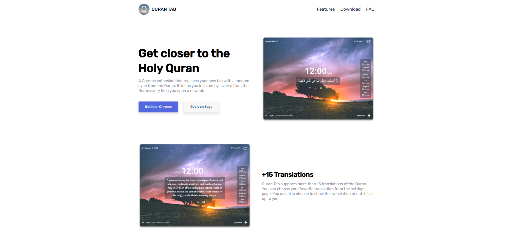

# 📖 Quran Tab – Landing Page

A simple and elegant **landing page** for the [Quran Tab browser extension](https://qurantab.com).  
This site introduces the extension, highlights its features, and provides direct download links for Chrome and Edge.



---

## 🚀 Features

- Modern and responsive landing page design  
- Clean UI showcasing Quran Tab’s functionality  
- Direct buttons to download the extension for **Chrome** and **Edge**  
- Extension Features include:
  - 12/24 clock system
  - Weather forecast
  - Dark theme
  - Prayer times integration
  - 20+ beautiful reciters
  - Multiple translations support (+15 translations available)

---

## 🛠️ Built With

- **HTML5** – semantic structure  
- **CSS3 & Sass** – modern styling and reusable components  
- **JavaScript (ES6)** – interactive elements and smooth behavior  

---

## 📂 Project Structure

```bash
├── index.html        # Main landing page
├── /css              # Compiled CSS files
├── /sass             # Source SCSS files
├── /js               # JavaScript files
├── /images           # Assets (screenshots, icons, backgrounds)
└── README.md         # Project documentation
````

---

## 🔧 How to Run Locally

1. Clone this repository:

   ```bash
   git clone https://github.com/yourusername/quran-tab-landing.git
   ```
2. Navigate to the project folder:

   ```bash
   cd quran-tab-landing
   ```
3. Open `index.html` in your browser
   *(for best results, serve with a local server: `npx serve .` or `python -m http.server`)*

---

## 🌍 Live Demo

👉 [View Online Demo](https://yourusername.github.io/quran-tab-landing/)

---

## 🤝 Contributing

Contributions are welcome!
If you’d like to improve the design, fix bugs, or add features, feel free to fork the repo and submit a pull request.

---

### ✨ Acknowledgements

* Instructed by [almdrasa.com](https://almdrasa.com/?srsltid=AfmBOoq3b5z-4WOFb2eGxPfihotnY_9o2R6RGIPozGjctbwVtn8OiY9u)


